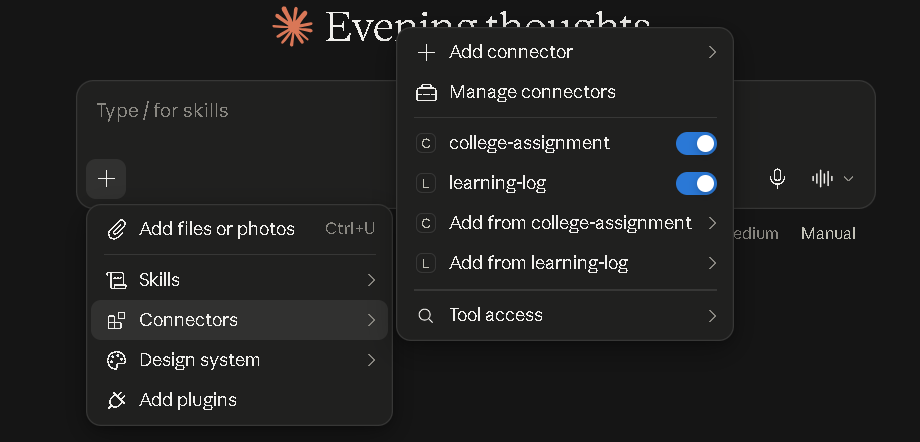
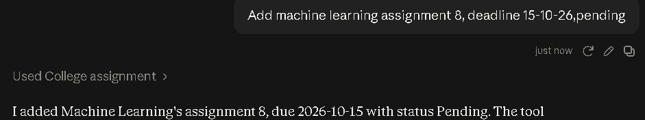
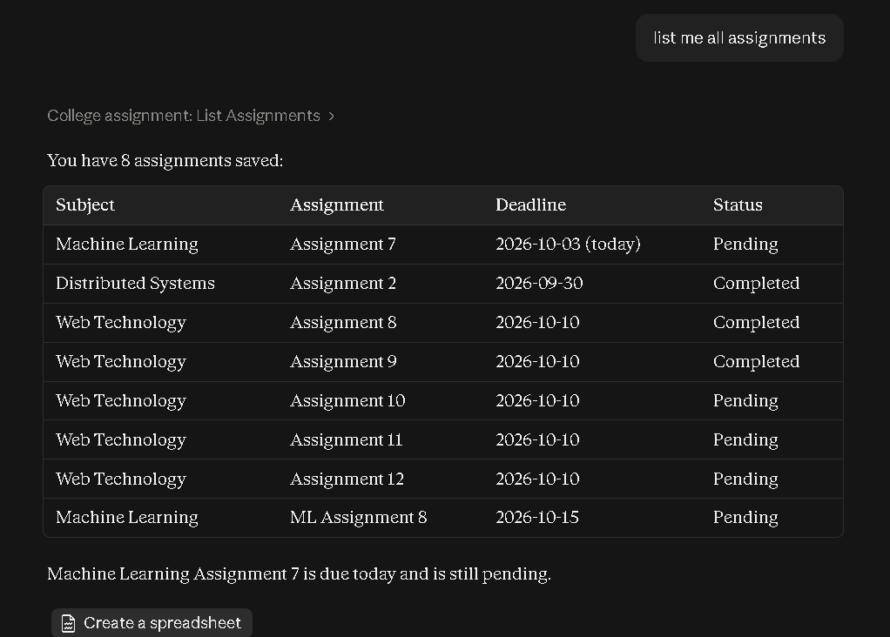
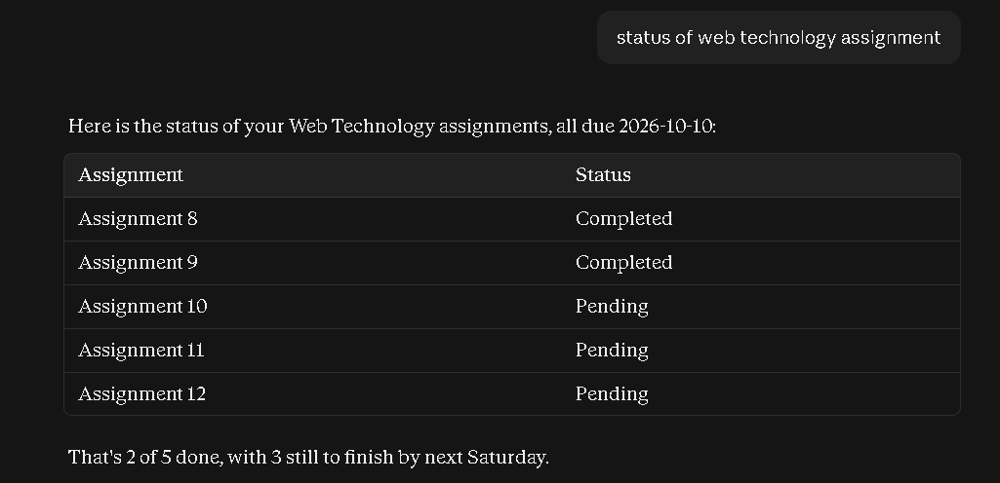
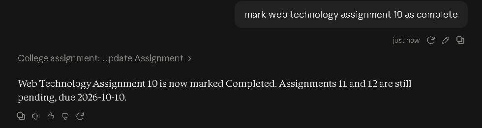
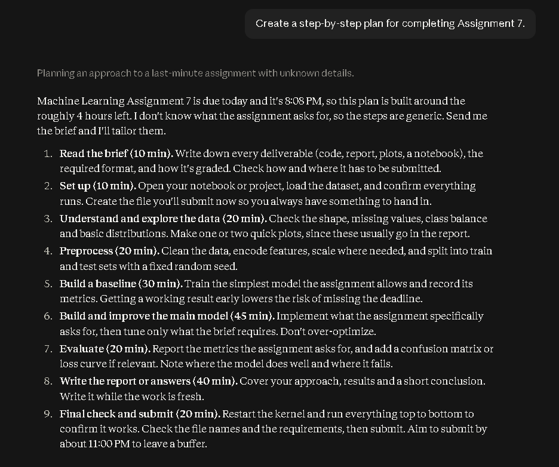

# 🎓 College Assignment Assistant MCP

A FastMCP-based College Assignment Assistant that allows students to manage their college assignments directly through Claude using natural language.

The project demonstrates how the Model Context Protocol (MCP) can connect an AI assistant to custom tools, resources, and prompts while maintaining persistent local assignment data.

---

## 📌 Overview

Managing multiple college assignments can become difficult when there are different subjects, deadlines, and completion statuses.

The College Assignment Assistant MCP provides a simple solution by allowing users to interact with their assignment data through Claude.


Instead of manually editing a JSON file, users can simply ask Claude to:

- Add a new assignment
- View all assignments
- Check an assignment's status
- Update an assignment
- Change a deadline
- Delete an assignment
- Create a plan for completing an assignment

All assignment information is stored locally in an `assignments.json` file.

---

## 🧩 MCP Components

This project demonstrates the three important MCP components:

1. **Tools**
2. **Resources**
3. **Prompts**

Each component has a different purpose and is used to give the AI assistant access to specific capabilities.

---

### 🛠️ 1. MCP Tools

MCP **Tools** allow Claude to perform actions or execute functions provided by the MCP server.

In this project, tools are used for operations that **change or retrieve assignment information**.

The server provides the following tools:

| Tool | Description |
|---|---|
| `add_assignment()` | Adds a new assignment |
| `list_assignments()` | Lists all assignments |
| `get_assignment_status()` | Checks the status and deadline of an assignment |
| `update_assignment()` | Updates an assignment's status or deadline |
| `delete_assignment()` | Deletes an assignment |

#### Why are Tools used?

Tools are used when Claude needs to **perform an operation**.

For example, when the user says:

> "Add Machine Learning Assignment 8 with deadline October 15."

Claude can call:

```text
add_assignment()
```

Similarly, Claude can use:

```text
list_assignments()
```

to retrieve all assignments, or:

```text
update_assignment()
```

to modify an existing assignment.

Therefore, MCP Tools provide the **action/operation layer** of the application.

---

### 📚 2. MCP Resource

An MCP **Resource** provides structured information or data that can be accessed by the AI assistant.

This project provides the resource:

```text
college://assignments
```

The resource gives access to the assignment information stored in the local `assignments.json` file.

#### Why is a Resource used?

The Resource is used when Claude needs access to the **assignment data itself**, rather than performing a specific action.

For example, the resource can provide information such as:

```json
[
  {
    "subject": "Machine Learning",
    "assignment": "Assignment 7",
    "deadline": "2026-10-03",
    "status": "Pending"
  }
]
```

Therefore, the MCP Resource provides the **data/information layer** of the application.

---

### 📝 3. MCP Prompt

An MCP **Prompt** provides a reusable prompt template that Claude can use for a specific task.

This project provides:

```text
plan_assignment()
```

The prompt is designed to help create a structured, step-by-step plan for completing a college assignment.

For example, the user can ask:

> "Create a plan for Machine Learning Assignment 7."

Claude can use the `plan_assignment()` prompt to generate a useful assignment completion plan.

#### Why is a Prompt used?

Prompts are used to provide Claude with a predefined structure or instruction for a particular task.

Instead of creating the same instruction manually every time, the MCP server provides a reusable prompt.

Therefore, the MCP Prompt provides the **instruction/guidance layer** of the application.

---

## 🏗️ Architecture

```text
                         ┌──────────────────────┐
                         │        User          │
                         │                      │
                         │ "Add ML Assignment 8"│
                         └──────────┬───────────┘
                                    │
                                    ▼
                         ┌──────────────────────┐
                         │       Claude         │
                         │    AI Assistant      │
                         └──────────┬───────────┘
                                    │
                                    │ MCP
                                    ▼
                  ┌──────────────────────────────────┐
                  │   College Assignment MCP Server  │
                  │                                  │
                  │            FastMCP               │
                  │                                  │
                  │  ┌────────────────────────────┐  │
                  │  │ add_assignment()           │  │
                  │  │ list_assignments()         │  │
                  │  │ get_assignment_status()    │  │
                  │  │ update_assignment()        │  │
                  │  │ delete_assignment()        │  │
                  │  └────────────────────────────┘  │
                  │                                  │
                  │  Resource:                       │
                  │  college://assignments           │
                  │                                  │
                  │  Prompt:                         │
                  │  plan_assignment()               │
                  └───────────────┬──────────────────┘
                                  │
                                  ▼
                       ┌─────────────────────┐
                       │  assignments.json   │
                       │                     │
                       │  Subject            │
                       │  Assignment         │
                       │  Deadline           │
                       │  Status             │
                       └─────────────────────┘
```

---

## 🔄 How It Works

The general workflow is:

```text
User
  ↓
Natural Language Request
  ↓
Claude
  ↓
MCP Protocol
  ↓
FastMCP Server
  ↓
Appropriate Tool / Resource / Prompt
  ↓
assignments.json
  ↓
Result returned to Claude
  ↓
Response shown to User
```

For example:

```text
User:
"Add Distributed Systems Assignment 3 with deadline
October 20, 2026 and status Pending."

                ↓

Claude identifies the required MCP tool

                ↓

add_assignment()

                ↓

assignments.json is updated

                ↓

Claude:
"Assignment added successfully."
```

---

## 📁 Project Structure

```text
college-assignment-mcp/
│
├── assignments.json
├── server.py
├── README.md
├── pyproject.toml
├── uv.lock
├── .python-version
├── .gitignore
│
└── src/
    └── college_assignment_mcp/
        └── __init__.py
```

### File Description

| File | Purpose |
|---|---|
| `server.py` | Main FastMCP server implementation |
| `assignments.json` | Stores assignment information |
| `pyproject.toml` | Project metadata and dependencies |
| `uv.lock` | Locked dependency versions |
| `.python-version` | Python version configuration |
| `.gitignore` | Files excluded from Git |
| `README.md` | Project documentation |

---

## 💾 Data Storage

Assignment information is stored locally in:

```text
assignments.json
```

Example:

```json
[
  {
    "subject": "Machine Learning",
    "assignment": "Assignment 7",
    "deadline": "2026-10-03",
    "status": "Pending"
  },
  {
    "subject": "Distributed Systems",
    "assignment": "Assignment 2",
    "deadline": "2026-09-30",
    "status": "Completed"
  }
]
```

Each assignment contains four fields:

| Field | Description |
|---|---|
| `subject` | College subject |
| `assignment` | Assignment name or number |
| `deadline` | Assignment deadline |
| `status` | Current assignment status |

Changes made through Claude are automatically written back to the JSON file.

---

## 🛠️ Technologies Used

- Python
- FastMCP
- Model Context Protocol (MCP)
- Claude Desktop
- uv
- JSON
- Git
- GitHub

---

## ⚙️ Installation

### Prerequisites

Make sure the following are installed:

- Python
- uv
- Claude Desktop
- Git

### 1. Clone the Repository

```bash
git clone https://github.com/sahilranade45/college-assignment-mcp.git
cd college-assignment-mcp
```

### 2. Install Dependencies

Install the project dependencies using uv:

```bash
uv sync
```

### 3. Run the MCP Server

Start the server using:

```bash
uv run server.py
```

The server will start and wait for an MCP client such as Claude to connect.

---

## 🔌 Connecting to Claude Desktop

The MCP server can be connected to Claude Desktop through its local MCP server configuration.

Example configuration:

```json
{
  "mcpServers": {
    "college-assignment": {
      "command": "C:\\Users\\ADMIN\\.local\\bin\\uv.exe",
      "args": [
        "--directory",
        "C:\\Users\\ADMIN\\OneDrive\\Desktop\\college-assignment-mcp",
        "run",
        "server.py"
      ]
    }
  }
}
```

> **Note:** Update the paths according to your own system.

After adding the configuration, restart Claude Desktop or reconnect the MCP server.

The server will then be available in Claude as:

```text
college-assignment
```

---

## 💬 Example Usage

Once the MCP server is connected to Claude, assignments can be managed using natural language.

### Add an Assignment

```text
Add Machine Learning Assignment 8 with deadline October 15, 2026 and status Pending.
```

Claude uses: `add_assignment()`

### View All Assignments

```text
Give me all the assignments.
```

Claude uses: `list_assignments()`

### Check Assignment Status

```text
What is the status of Assignment 7?
```

Claude uses: `get_assignment_status()`

### Update Assignment Status

```text
Mark Assignment 7 as Completed.
```

Claude uses: `update_assignment()`

### Change Assignment Deadline

```text
Change Assignment 7's deadline to October 18, 2026.
```

Claude uses: `update_assignment()`


### Create an Assignment Plan

```text
Create a step-by-step plan for completing Assignment 7.
```

Claude can use: `plan_assignment()`

---

## 🔐 Data Storage and Privacy

Assignment data is stored locally in:

```text
assignments.json
```

The project does not require a separate cloud database for storing assignment information.

The MCP server is designed to work with locally stored assignment data and a locally configured Claude MCP connection.

---

## 🎯 Learning Objectives

This project was created to understand how MCP can be used to extend AI assistants with custom functionality.

Through this project, the following concepts are demonstrated:

- Understanding the Model Context Protocol
- Building an MCP server
- Working with FastMCP
- Creating MCP tools
- Creating MCP resources
- Creating MCP prompts
- Connecting an MCP server to Claude
- Handling tool calls from natural-language requests
- Implementing CRUD operations
- Reading and writing JSON data
- Persisting application data
- Managing Python dependencies with uv
- Connecting local applications with an AI assistant

---

## 📚 MCP Operations Summary

| MCP Component | Name | Purpose |
|---|---|---|
| Tool | `add_assignment()` | Add an assignment |
| Tool | `list_assignments()` | List all assignments |
| Tool | `get_assignment_status()` | Check assignment status and deadline |
| Tool | `update_assignment()` | Update assignment information |
| Tool | `delete_assignment()` | Delete an assignment |
| Resource | `college://assignments` | Access assignment data |
| Prompt | `plan_assignment()` | Generate an assignment planning prompt |

---


## 🤝 Contributing

Contributions are welcome.

To contribute:

```bash
git clone https://github.com/sahilranade45/college-assignment-mcp.git
cd college-assignment-mcp
```

Create a new branch:

```bash
git checkout -b feature/new-feature
```

Make your changes and commit them:

```bash
git add .
git commit -m "Add new feature"
```

Push the branch:

```bash
git push origin feature/new-feature
```

Then create a pull request.

---

## 📄 License

This project is intended for educational and learning purposes.

---

## 👨‍💻 Author

**Sahil Ranade**
Computer Engineering Student

GitHub: [https://github.com/sahilranade45](https://github.com/sahilranade45)

---

## ⭐ Project

If you found this project useful for learning MCP and FastMCP, consider giving the repository a ⭐ on GitHub.